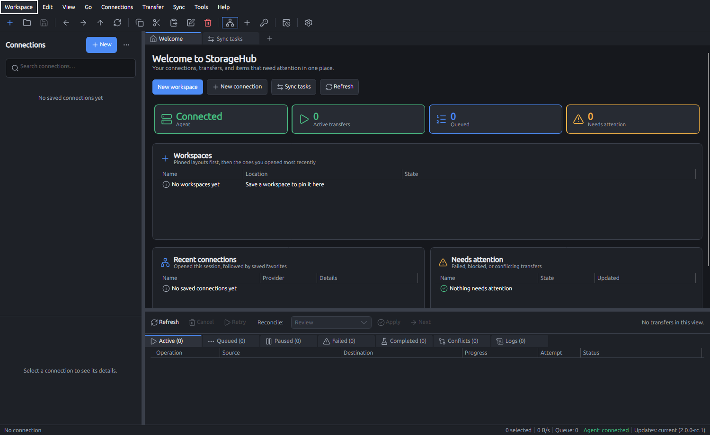
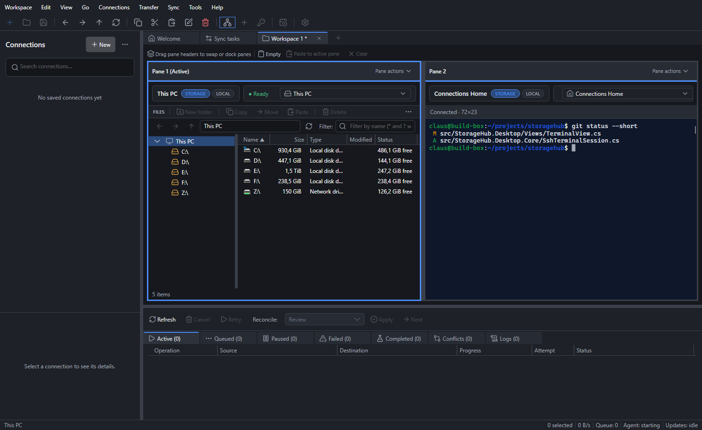
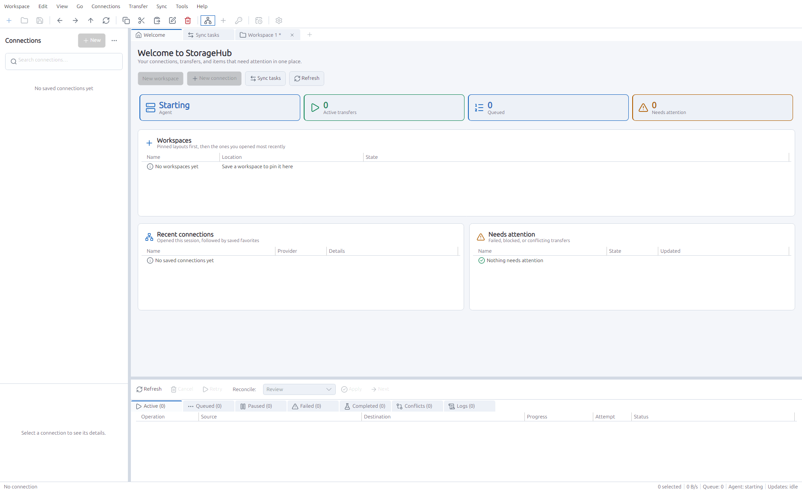
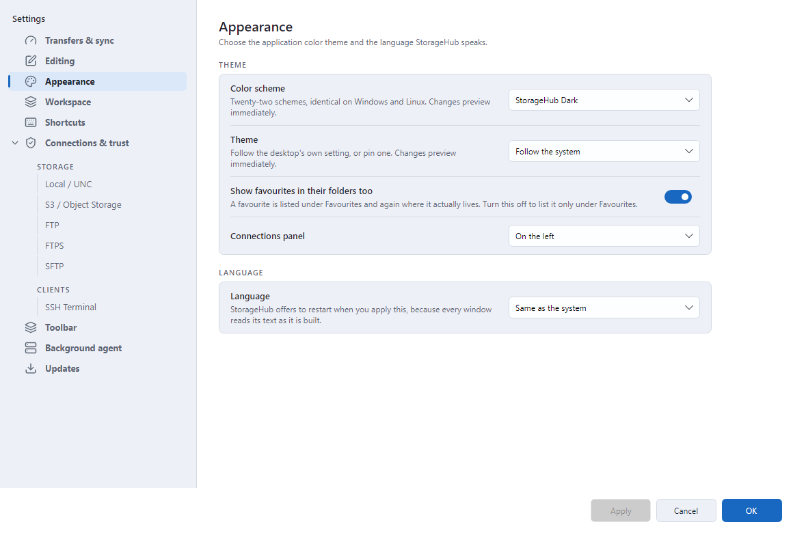

<p align="center">
  
</p>

# StorageHub

A file manager, transfer client, and synchronization engine for Windows and
Linux, for people who move files they cannot afford to lose.

Put local disks and remote storage side by side. Queue a transfer and close the
window — it keeps running. Synchronize two locations and see exactly what is
about to change before anything is touched. Every credential lives in an
encrypted vault, and no server is trusted until you have checked its fingerprint
yourself.

Open source, and built with C# and .NET 10. The desktop is
[Avalonia](https://avaloniaui.net/), so Windows and Linux run the same shell
from the same source. It sits on the CodeLogic application lifecycle and
adapts the all-in-one `CL.Storage` (`CodeLogic.Storage`) provider library behind
a provider-neutral contract.

> [!IMPORTANT]
> `main` is StorageHub 2.0, which ships as pre-releases until 2.0.0 is tagged.
> StorageHub 1.4.5 is still the current stable release, marked Latest on the
> releases page; the 1.4 source is kept on the
> [`1.x-archive`](https://github.com/StorageHub-app/StorageHub/tree/1.x-archive)
> branch. Release binaries are not yet code-signed, so Windows SmartScreen may
> warn on first run; verify downloads against the published `SHA256SUMS`. As
> with any file-management tool, keep an independent backup of irreplaceable
> data.

## A look at it

<table>
  <tr>
    <td width="50%"><a href="docs/screenshots/welcome.png"></a></td>
    <td width="50%"><a href="docs/screenshots/workspace.png"></a></td>
  </tr>
  <tr>
    <td><b>Welcome</b> - connections, transfers, and anything that needs attention, in one place.</td>
    <td><b>Workspaces</b> - one to four panes, any mix of local, remote, and SSH terminal.</td>
  </tr>
  <tr>
    <td><a href="docs/screenshots/welcome-linux-light.png"></a></td>
    <td><a href="docs/screenshots/settings-appearance.png"></a></td>
  </tr>
  <tr>
    <td><b>On Linux</b> - the same window, the same controls, here in the light theme.</td>
    <td><b>Settings</b> - twenty-two colour schemes, light and dark, identical on both systems.</td>
  </tr>
</table>

## Features

**Browse and manage** — Workspaces of one to four equal-capability panes, in six
layouts from a single pane to a 2×2 grid, each with a folder tree beside its
list. Workspaces save to `.shw` files, the same format 1.4 used, so a 1.4
workspace opens in 2.0; pinning one reopens it where you left off. Each pane's
connection bar and its FILES bar can be hidden per pane when you want the whole
pane for the listing. Local and remote browsing is asynchronous, with history,
filtering, and bounded paging, so a folder with a hundred thousand objects does
not freeze the window. Create, rename, batch-rename, and delete items; inspect
versions, metadata, and tags read-only. Drop files in from File Explorer,
Nautilus, or Dolphin, and drag them out again; on Windows that includes a remote
connection's files, which the agent downloads to wherever they were dropped.

**Connect securely** — Typed profiles for Local/UNC, S3 and S3-compatible, FTP,
FTPS, and SFTP storage plus SSH terminal clients, in a connections panel of
groups you make and drag between, with favorites, search, and an icon and
colour of their own. Credentials live in an encrypted vault — its key protected
by Windows DPAPI for your account, or in a file only your account can read on
Linux — and never enter profile JSON, logs, or diagnostics. Keys and
certificates live in a shared key store, so rotating one updates every profile
that uses it instead of sending you hunting. An SSH key without a passphrase is
accepted, with a warning that one is still recommended. Server identity is
pinned explicitly: no certificate or host key is accepted on first contact. The
connection editor can fetch an SFTP or SSH server's host key for you to accept
or reject.

**Transfer durably** — Any-to-any copy and move with source preconditions,
optional SHA-256 verification, and delete-only-after-verified-commit move
semantics. Jobs are queued in SQLite with fenced claims, checkpoints, retries,
and interrupted-owner recovery, and execute in the background agent — closing
the desktop does not discard accepted work.

**Synchronize and schedule** — Three-way classification with conflict
categories and deletion guards, producing immutable SHA-256 plans. Preview is
read-only; applying requires an explicit approval bound to the plan, verified
roots, and live capabilities. Schedules honor time zones and DST, starting on
the time zone Settings names (the system's own by default). A schedule either
prepares a plan for you to review, or runs on its own when the plan only adds or
replaces files; anything that deletes or conflicts waits for you.

**SSH terminal** — A managed SSH.NET client with no PuTTY dependency, in a pane
of its own. Sessions run in the agent with vault-backed authentication and
verified host keys. A full VT emulator renders the alternate screen, so `htop`,
`vim`, `less`, and `nano` draw correctly and leave your scrollback intact on
exit. Resizing tells the remote its new size. ANSI, 256-color, and true-color
with inverse, underline, and box drawing; the mouse is forwarded to programs
that ask for it, with Shift to select locally.

**In your language** — English, Danish, and German. Pick one in Settings or
follow the system; StorageHub offers to restart so the change takes effect
everywhere at once.

**Themes and settings** — Twenty-two colour schemes, from StorageHub's own light
and dark to Solarized, Nord, Gruvbox, Catppuccin, and two high-contrast ones,
drawn the same on Windows and Linux. Follow the system's light or dark setting,
or pin one. Settings are laid out as captioned cards of labelled rows and cover
transfers and sync, editing, appearance, workspaces, the toolbar's contents,
rebindable shortcuts, per-provider connection defaults and trust policy, the
background agent, and updates. Settings, connections, and sync tasks can be
exported and imported, optionally password-protected.

What is implemented is what is described above and covered by the test suite.
Provider coverage is listed under [Provider status](#provider-status). How 2.0
reached parity with 1.4, screen by screen, is in the
[port inventory](docs/port-inventory.md) and the [roadmap](docs/roadmap.md).

## Install

Download from [GitHub Releases](https://github.com/StorageHub-app/StorageHub/releases).
1.4.5 is the release marked Latest; 2.0 builds are the newest pre-releases.

| | x64 (Intel and AMD) | ARM64 |
| --- | --- | --- |
| Windows 10 and 11, a per-user installer | `StorageHub-<version>-win-x64.msi` | `StorageHub-<version>-win-arm64.msi` |
| Debian and Ubuntu | `storagehub_<version>_amd64.deb` | `storagehub_<version>_arm64.deb` |

Every file is listed in the release's `SHA256SUMS`, and each is built with
GitHub artifact attestations, so `gh attestation verify <file> --repo
StorageHub-app/StorageHub` shows which workflow run and commit produced it.

### Windows

The MSI does not require elevation, installs into
`%LOCALAPPDATA%\Programs\StorageHub` with a Start menu shortcut, and starts the
background agent at sign-in as you. The agent keeps its database and vault in
`%PROGRAMDATA%\StorageHub`, protected to your account; preferences stay under
`%LOCALAPPDATA%\StorageHub`. Neither is touched by an upgrade or an uninstall.

Each release's MSI is silently installed, checked, and uninstalled by CI on a
disposable runner of its own architecture before it is published.

### Linux

```sh
sudo apt install ./storagehub_<version>_amd64.deb
```

StorageHub installs into `/opt/storagehub` with a menu entry, and runs its agent
per user under `systemd --user` as the `storagehub-agent` unit, which needs no
root. The desktop starts that unit when it opens; to have the agent start at
sign-in instead, enable it for your account:

```sh
systemctl --user enable --now storagehub-agent
```

The database and vault live in `~/.local/share/storagehub` (or
`$XDG_DATA_HOME/storagehub`). A user unit stops when you sign out; for schedules
to keep running with nobody signed in, enable lingering for your account with
`loginctl enable-linger`, which StorageHub leaves to you.

The packages are built and tested on Ubuntu 24.04, where CI installs each one
with `apt`, starts it under `xvfb`, and removes it again.

### Coming from 1.4

2.0 keeps the agent's data somewhere new and does not read 1.4's database or a
1.4 settings export, so saved connections and credentials have to be set up
again. Workspace (`.shw`) files carry across. An installation that ran the 1.4
agent as a Windows service must have that service removed before the 2.0 agent
can use its data folder; `eng/remove-legacy-agent-service.ps1`, run elevated,
does that and deletes the old service's data with it.

### How the background agent runs

The agent is the part that actually moves files: it owns the transfer queue, the
schedules, and the database, which is why closing the window does not stop a
transfer. It always runs as you, never as a service. On Windows, how long it
runs is your choice, in **Tools > Settings > Background agent**:

| Mode | The agent runs | Choose it when |
| --- | --- | --- |
| **When I sign in** | From the moment you sign in until you sign out, window open or not | You want queued transfers and schedules to carry on after closing StorageHub |
| **Only while StorageHub is open** | Only alongside the window, with no sign-in entry and nothing left behind | You would rather nothing ran in the background |

An installed copy asks once, on first run. Scheduled work does not progress
while you are signed out of Windows. On Linux the same choice is whether the
`storagehub-agent` unit is enabled, which is made with `systemctl` as shown
above rather than in Settings.

### Updates

Installed builds check the official GitHub releases at startup and download the
package for the machine's own architecture — the MSI on Windows, the `.deb` on
Linux — checking it against the release's `SHA256SUMS` before anything runs it.
An x64 copy on an ARM64 PC is offered the ARM64 MSI, which replaces it.
Settings can turn off automatic checks or downloads, include or exclude release
candidates, or opt into installing and restarting on its own.
**Help > Check for Updates...** remains available when automatic checks are off.
On Linux the package is installed through `apt`, with polkit asking for your
password. Builds run from source never modify an installation.

## Provider status

`CL.Storage` supplies native implementations without PuTTY or external transfer
executables. StorageHub exposes those implementations only through capability
checks; a provider is not complete merely because it exists in the library.

| Provider | In `CL.Storage` | StorageHub profile model | End-to-end StorageHub coverage |
| --- | :---: | :---: | --- |
| Local directories and UNC paths | Yes | Yes | Real integration test |
| Amazon S3 and S3-compatible services | Yes | Yes | Hermetic MinIO interoperability and hostile-input test |
| FTP, explicit FTPS, implicit FTPS | Yes | Yes | Hermetic interoperability, pin/downgrade, and client-PFX tests |
| SFTP | Yes, via SSH.NET | Yes | Hermetic password/key interoperability and hostile host-key tests |
| SSH terminal client | Managed SSH.NET client | Yes | Hermetic open/write/read/resize/close test beside SFTP |
| WebDAV | Yes | Not yet | Pending |
| Azure Blob Storage | Yes | Not yet | Pending |
| Google Cloud Storage | Yes | Not yet | Pending |
| OpenStack Swift | Yes | Not yet | Pending |

A provider moves out of *Pending* only once it has a StorageHub profile model,
credential and trust mapping, capability conformance tests, and a hermetic
integration test. Existing in `CL.Storage` is not enough.

## Build from source

### Prerequisites

- Windows with PowerShell, or Linux
- [.NET SDK 10.0.401](global.json), or a later 10.0 patch accepted by `global.json`
- Git
- Visual Studio C++ build tools with the Desktop development workload —
  **only** on Windows, and only to build the Explorer drop broker that the
  installer ships. An ordinary build leaves it out and says so.
- CPython 3.12 — **only** to run the FTP/FTPS and SFTP test fixtures, which
  stand up real loopback servers for the integration tests. StorageHub itself
  has no Python dependency. CI pins 3.12.10. [`eng/testlab`](eng/testlab/README.md)
  is the alternative: real SFTP, FTP, and S3 servers in Docker.

The CodeLogic framework and `CL.Storage` provider library are restored from the
centrally pinned `CodeLogic` and `CodeLogic.Storage` NuGet packages.

### Restore, build, and test

```powershell
dotnet restore StorageHub.slnx --locked-mode
dotnet build StorageHub.slnx --configuration Release --no-restore
dotnet test StorageHub.slnx --configuration Release --no-build --no-restore
dotnet list StorageHub.slnx package --vulnerable --include-transitive --no-restore
```

The same commands work on Linux. Warnings are errors, package versions are
centrally managed, and StorageHub projects restore from committed lock files.
CI runs the Release build, the full test suite, and the vulnerability audit on
Windows, and the desktop tests again on Linux.

Every successful push to `main` publishes a uniquely versioned pre-release once
the build, tests, dependency audit, packaging, and the install checks of all
four packages pass. A failed check produces no release. How versions and
releases are cut is in [Versioning and merges](docs/versioning.md) and
[Release engineering](docs/releasing.md).

### Provider fixtures

```powershell
.\eng\run-provider-smoke.ps1
```

This starts pinned loopback MinIO, FTP/FTPS, and SFTP services, exercises their
real health/read/write behavior, and runs provider-neutral transfers between
each supported remote direction and Local storage. S3 is verified in both
directions. FTP and SFTP outbound create is verified to fail closed, because
those protocols cannot provide StorageHub's required atomic create-if-absent
guarantee.

### Run from source

Start the background agent first:

```powershell
dotnet run --project src/StorageHub.Agent.Host --configuration Release
```

Then the desktop in another terminal:

```powershell
dotnet run --project src/StorageHub.Desktop --configuration Release
```

A desktop run from source does not start an agent of its own: it uses the one
already answering for your account, and its splash says so if there is none.
`eng/run-dev-agent.ps1` builds and starts the agent in the background on
Windows.

The agent uses the same data folder as an installed copy
(`%PROGRAMDATA%\StorageHub` on Windows, `~/.local/share/storagehub` on Linux).
Set `STORAGEHUB_DATA_ROOT` before starting it to use an isolated development
data directory. `--run-once` performs startup and a clean shutdown; `--health`
runs the CodeLogic health path.

## Using StorageHub

File commands act on the pane marked **Active**, outlined in the theme accent
color. Defaults include Ctrl+C/Ctrl+X/Ctrl+V for copy/cut/paste, Ctrl+A for
select all, F2 for rename, Delete for delete, Ctrl+Shift+N for a folder,
Ctrl+Alt+N for an empty file, F5 for refresh, Ctrl+L for the address, F6 for
the next pane, and Ctrl+B to show or hide the connections panel. Text fields
and SSH terminal input keep their own keyboard behavior; file shortcuts never
operate on SSH panes.

Use **Tools > Settings > Shortcuts** to reassign commands, clear a binding, or
restore the defaults. Conflicting shortcuts must be cleared before reassignment.

## Documentation

- [Changelog](CHANGELOG.md)
- [Architecture](docs/architecture.md)
- [Versioning and merges](docs/versioning.md)
- [Release engineering](docs/releasing.md)
- [2.0 roadmap](docs/roadmap.md) and [port inventory](docs/port-inventory.md)
- [Contributing](CONTRIBUTING.md)

StorageHub is written to keep credentials in a vault only your account can
read, to refuse a server whose identity has not been confirmed, and to treat
every delete, overwrite, and resume as its own decision. None of that has been
independently audited. Report a suspected vulnerability privately through the
repository's **Security** tab (**Report a vulnerability**) rather than in a
public issue, and never put a credential or private key in an issue, log, or
test fixture.

## License

StorageHub is licensed under the [MIT License](LICENSE).
